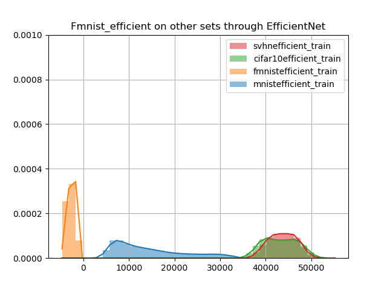

# Trained on Fmnist through EfficientNet

EfficientNet b-0 was used.
model = EfficientNet.from_name("efficientnet-b0", num_classes=3, include_top=False, in_channels=1)

SVHN and Cifar10 had the following transformations:
our_transforms = transforms.Compose([
        transforms.CenterCrop(28),
        transforms.Grayscale(num_output_channels=1),
        transforms.ToTensor(),
        transforms.Normalize(mean=[0.5], std=[0.5]),
        ])

{
    "batch_dim": 100,
    "clip_norm": 0.1,
    "cooldown": 10,
    "dataset": "fmnistefficient",
    "decay": 0.5,
    "device": "cuda:0",
    "early_stopping": 100,
    "epochs": 1000,
    "expname": "",
    "flows": 1,
    "hidden_dim": 10,
    "layers": 1,
    "learning_rate": 0.01,
    "load": null,
    "min_lr": 0.0005,
    "n_dims": 1280,
    "path": "checkpoint\\fmnistefficient_layers1_h10_flows1_gated_2020-10-30-11-21-11",
    "patience": 20,
    "polyak": 0.998,
    "residual": "gated",
    "save": true,
    "tensorboard": "tensorboard"
}
