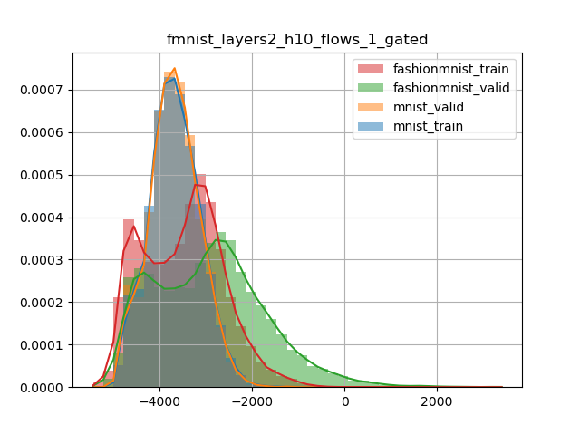

# BNAF trained on fmnist evaluated on mnist

## Hyperparameters

{
    "batch_dim": 200,
    "clip_norm": 0.1,
    "cooldown": 10,
    "dataset": "fashionmnist",
    "decay": 0.5,
    "device": "cuda:0",
    "early_stopping": 100,
    "epochs": 1000,
    "expname": "",
    "flows": 1,
    "hidden_dim": 10,
    "layers": 2,
    "learning_rate": 0.01,
    "load": null,
    "min_lr": 0.0005,
    "n_dims": 784,
    "path": "checkpoint\\fashionmnist_layers2_h10_flows1_gated_2020-10-08-10-28-43",
    "patience": 20,
    "polyak": 0.998,
    "residual": "gated",
    "save": true,
    "tensorboard": "tensorboard"
}
