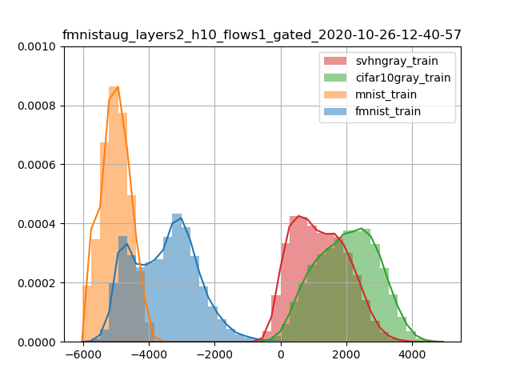
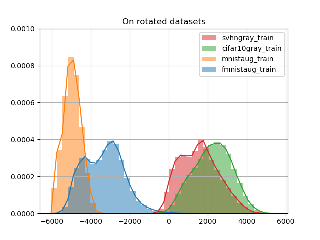

# BNAF trained on fmnistaug tested on four datasets

## Model tested on training parts of datasets with no rotations

## Model tested on training parts of datasets with rotations

CIFAR10 and SVHN were converted with

transforms.Compose([
                transforms.CenterCrop(28),
                transforms.Grayscale(num_output_channels=1),
                transforms.ToTensor(),
                transforms.Normalize(mean=[0.5], std=[0.5]),
                ])

## Hyperparameters

{
    "batch_dim": 200,
    "clip_norm": 0.1,
    "cooldown": 10,
    "dataset": "fmnistaug",
    "decay": 0.5,
    "device": "cuda:0",
    "early_stopping": 100,
    "epochs": 1000,
    "expname": "",
    "flows": 1,
    "hidden_dim": 10,
    "layers": 2,
    "learning_rate": 0.01,
    "load": null,
    "min_lr": 0.0005,
    "n_dims": 784,
    "path": "checkpoint\\fmnistaug_layers2_h10_flows1_gated_2020-10-26-12-40-57",
    "patience": 20,
    "polyak": 0.998,
    "residual": "gated",
    "save": true,
    "tensorboard": "tensorboard"
}